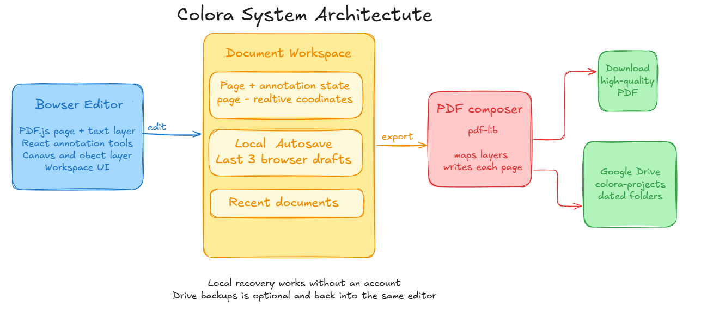
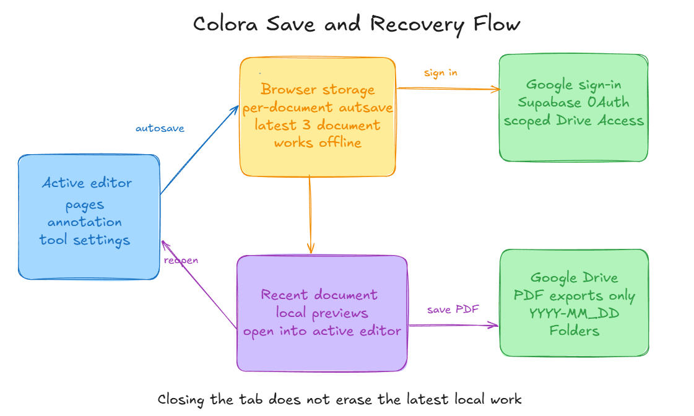
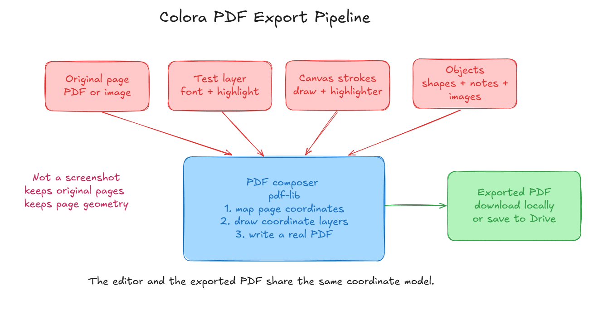

<div align="center">
  

  # Colora

  **A calm, browser-first PDF annotation workspace.**

  Open documents, highlight ideas, draw freely, add text and notes, recover recent work locally, and export polished PDFs without leaving the browser.

  [](https://colora-devo.vercel.app)
  [](https://nextjs.org/)
  [](https://react.dev/)
  [](https://www.typescriptlang.org/)
</div>

---

## Demo

https://github.com/user-attachments/assets/c21dbb6c-9ea2-4ffe-ab8b-2e262e1f3257

[Open or download the Colora demo video](public/assets/colora-demo.mp4)

---

## What Colora Does

Colora is designed for students, researchers, designers, and professionals who spend time reading and marking up documents. It combines a selectable PDF text layer with freeform canvas tools, movable annotations, local recovery, and high-quality PDF export.

The editor stays intentionally lightweight:

- No account is required for local editing or recovery.
- The latest three documents are stored locally in the browser.
- Google sign-in is optional and adds Drive PDF backup.
- Drive exports are organized inside `colora-projects/YYYY-MM-DD`.
- Saved local or Drive documents reopen inside the current editor workspace.

## Highlights

| Area | Capabilities |
| --- | --- |
| Documents | Open PDFs and images, create blank projects, edit multiple pages |
| Annotation | Highlight, draw, erase, add text, signatures, notes, pictures, and shapes |
| Selection | Select, drag, resize, reposition, edit, and delete annotations |
| Text | Font size, color, alignment, line spacing, bold, italic, underline, and lists |
| Shapes | Rectangle, ellipse, diamond, line, arrow, stroke, fill, and rough styling |
| Recovery | Per-document browser autosave with recent-document previews |
| Drive | Optional Google OAuth and dated PDF backup folders |
| Export | High-quality PDF generation using the original page geometry |

---

## Architecture

Colora is browser-first. The active document, annotation layers, and tool state live in the editor; local recovery protects recent work without requiring an account. PDF.js renders source pages and selectable text, while pdf-lib composes the final document. Optional Google authentication grants scoped Drive access for PDF backups.

### System Architecture



### Save and Recovery Flow



### PDF Export Pipeline



---

## Editing Model

Each document is represented as page data plus editable annotation layers:

- Original PDF or image page background
- Selectable PDF text layer
- Vector drawing and highlighting strokes
- Text annotations and inline text highlights
- Pictures, sticky notes, signatures, and shapes
- Page view, zoom, theme, and export settings

Coordinates are stored relative to the document page. The export composer maps those coordinates into the output PDF so annotations stay aligned with the content instead of being exported as a screenshot of the editor.

## Local Recovery

Colora saves recent work per document in the browser. This protects work after an accidental refresh, tab close, or browser restart.

- Keeps the latest three local documents to control storage use
- Includes annotated PDFs, images, and blank projects
- Shows recent-document previews in the workspace
- Reopens a saved document in the active editor
- Works without Google sign-in or a backend database

Browser storage is device- and browser-specific. Clearing site data also clears local recovery documents, so important work should be exported or backed up to Drive.

## Google Drive Backup

Google Drive is optional. Colora uses Supabase only for Google OAuth, then uses the granted Google provider token to work with Drive.

The Drive structure is:

```text
My Drive/
└── colora-projects/
    ├── 2026-08-20/
    │   └── annotated-document.pdf
    └── 2026-08-21/
        └── research-notes.pdf
```

Only exported PDFs are stored in Drive. Internal editor JSON is not uploaded.

---

## Annotation Tools

- **Select** — select, move, and resize text, pictures, notes, and shapes
- **Highlight** — add translucent document highlights
- **Draw** — create freehand vector strokes
- **Shape** — rectangle, ellipse, diamond, line, and arrow
- **Text** — add rich text with wrapping and alignment controls
- **Sign** — place handwritten signatures
- **Eraser** — remove drawing or highlight strokes
- **Note** — add editable sticky notes with contrasting borders
- **Picture** — insert and resize images on a page

Only one primary tool is active at a time. The editor returns to Select mode to prevent drawing, highlighting, or erasing from interfering with object manipulation.

## Keyboard Shortcuts

| Shortcut | Action |
| --- | --- |
| `Esc` | Return to Select / exit the active action |
| `Ctrl/Cmd + Z` | Undo |
| `Ctrl/Cmd + Shift + Z` or `Ctrl/Cmd + Y` | Redo |
| `Ctrl/Cmd + O` | Open a PDF or image |
| `Ctrl/Cmd + N` | Start a new blank project |
| `Ctrl/Cmd + S` | Export PDF |
| `H` | Highlighter |
| `V` | Select / hand tool |
| `P` or `D` | Draw |
| `T` | Text |
| `S` | Signature |
| `E` | Eraser |
| `R` | Rectangle |
| `O` | Ellipse |
| `M` | Diamond |
| `L` | Line |
| `A` | Arrow |
| `N` | Sticky note |
| `I` | Insert image |
| `Delete` | Delete the selected object or current page |
| `Left` / `Page Up` | Previous page |
| `Right` / `Page Down` | Next page |
| `+` / `-` | Zoom in / out |
| `0` | Fit page to width |

---

## Technology

| Technology | Role |
| --- | --- |
| Next.js 16 | Application shell, routing, and optional API route |
| React 19 | Interactive editor and workspace UI |
| TypeScript | Document, annotation, and integration types |
| PDF.js | PDF rendering and selectable text layers |
| pdf-lib | PDF composition and export |
| RoughJS | Excalidraw-inspired shape rendering and architecture diagrams |
| Supabase Auth | Optional Google OAuth flow |
| Google Drive API | Optional PDF backup and recent Drive files |
| Browser storage | Local autosave and recent-document recovery |
| Tailwind CSS | Styling and responsive interface layout |

## Project Structure

```text
src/
├── app/
│   ├── editor/page.tsx        # Main editor and workspace
│   ├── api/generate-text/     # Optional AI text route
│   ├── page.tsx               # Product landing page
│   └── globals.css            # Global theme and interface styles
└── lib/
    ├── google-drive.ts        # Drive folders, uploads, and listings
    ├── local-document.ts      # Local editor-state types
    └── supabase-auth.ts       # Google OAuth session flow

public/
├── architecture/              # SVG and PNG architecture diagrams
├── assets/colora-demo.mp4     # Product demonstration video
└── fonts/                     # Excalifont and Geist
```

---

## Run Locally

### Requirements

- Node.js 20 or newer
- npm

### Installation

```bash
git clone https://github.com/arnabjena007/Colora.git
cd Colora
npm install
npm run dev
```

Open [http://localhost:3000](http://localhost:3000).

Local editing and autosave work without environment variables. Google sign-in and Drive backup require the optional Supabase configuration below.

### Environment Variables

Create `.env.local` in the project root:

```env
NEXT_PUBLIC_SUPABASE_URL=https://your-project.supabase.co
NEXT_PUBLIC_SUPABASE_ANON_KEY=your-anon-key
NEXT_PUBLIC_AUTH_REDIRECT_URL=http://localhost:3000/editor
NEXT_PUBLIC_SITE_URL=http://localhost:3000
```

For production, configure the same variables in Vercel and use the production editor URL:

```env
NEXT_PUBLIC_AUTH_REDIRECT_URL=https://colora-devo.vercel.app/editor
NEXT_PUBLIC_SITE_URL=https://colora-devo.vercel.app
```

Never expose a Supabase service-role key through a `NEXT_PUBLIC_` variable. Colora’s current browser-first architecture does not require a service-role key.

### Google OAuth Setup

1. Enable Google authentication in Supabase.
2. Create a Google OAuth web client.
3. Add the Supabase callback URL as an authorized redirect URI:

```text
https://YOUR_PROJECT_REF.supabase.co/auth/v1/callback
```

4. Add local and production URLs to the Supabase redirect allowlist.
5. Enable the Google Drive API for the Google Cloud project.
6. Redeploy after changing production environment variables.

The app requests the `drive.file` scope, allowing it to manage files created or opened through Colora rather than requesting unrestricted access to the entire Drive.

## Available Scripts

```bash
npm run dev      # Start the development server
npm run build    # Create a production build
npm run start    # Start the production server
npm run lint     # Run ESLint
```

## Production Build

Always verify the production build before deployment:

```bash
npm run build
```

The repository is configured for deployment on Vercel.

---

## Contributing

Contributions are welcome. For substantial changes, open an issue first so the interaction and export behavior can be discussed before implementation.

1. Fork the repository.
2. Create a feature branch.
3. Make and test the change.
4. Run `npm run build`.
5. Open a pull request with screenshots or a short recording for UI changes.

## Links

- [Live application](https://colora-devo.vercel.app)
- [GitHub repository](https://github.com/arnabjena007/Colora)
- [Issue tracker](https://github.com/arnabjena007/Colora/issues)

---

<div align="center">
  Built for calm, focused document work.
</div>
